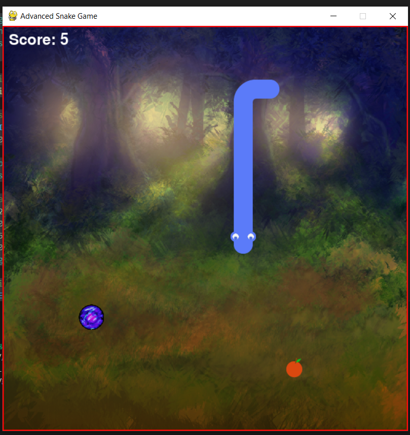

# Advanced Snake Game

## Overview
The Advanced Snake Game is a modern twist on the classic snake game, featuring enhanced graphics, bonus food, and improved gameplay mechanics. The player controls a snake that grows in length as it eats food while avoiding collisions with the walls and itself.

## Features
- **Graphics**: Custom graphics for the snake's head, body, tail, and food.
- **Bonus Food**: Collect bonus food for extra points after eating a certain number of regular food items.
- **Score Display**: Keeps track of the player's score during gameplay.
- **Game Over Screen**: Displays the final score with options to play again or quit.

## Requirements
- Python 3.x
- Pygame library

## Installation
1. Clone this repository:
   ```bash
   git clone https://github.com/AditHash/Python-Snake-Game.git
   ```
2. Navigate to the project directory:
   ```bash
   cd Python-Snake-Game
   ```
3. Install Pygame if you haven't already:
   ```bash
   pip install -r requirements.txt
   ```

4. Place the required assets (images, sounds) in the appropriate folders as follows:
   ```
   assets/
       body/
           head_left.png
           head_right.png
           head_up.png
           head_down.png
           body_horizontal.png
           body_vertical.png
           body_topleft.png
           body_topright.png
           body_bottomleft.png
           body_bottomright.png
           tail_left.png
           tail_right.png
           tail_up.png
           tail_down.png
       food/
           apple.png
           cookies.png
       background/
           background.png
       sounds/
           EatSound.ogg
   ```

## Usage
To run the game, execute the following command in your terminal:
```bash
python snake_game.py
```

## Controls
- **Arrow Keys**: Control the direction of the snake (Up, Down, Left, Right).
- **C**: Play again after a game over.
- **Q**: Quit the game.

## Screenshots


## Acknowledgements
- Developed using Python and Pygame.
- Special thanks to the https://opengameart.org/ for assets.


